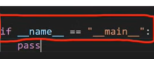
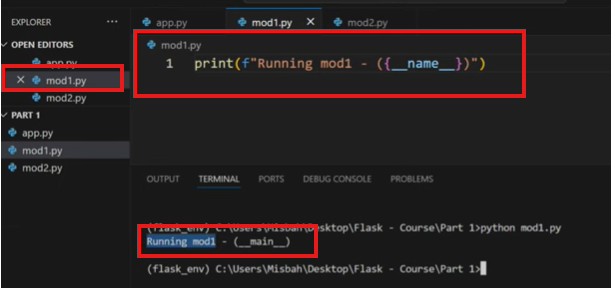
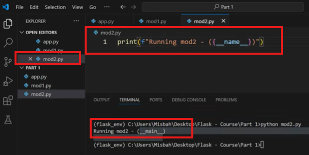

- In python these .py file called module. and if we create mod100 and run this, the o/p will be carry __main__.

- In mod1 scope __name__ = "__main__"
- In mod2 scope __name__ = "__main__"

- So, in python module python assign __name__ variable; and it will call it as __main__.

------------------------------------------

- Whenever we write the import statement, python will always execute that module.

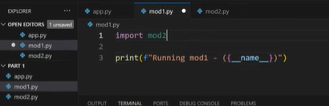
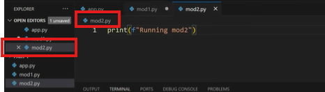
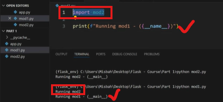

- When we ran mod1; python show import statement first, import mod2; So python went ahead and executed mod2 [print(f"Running mod2")]. After this, print(f"Running mod1 - {(__name__)}") executed.

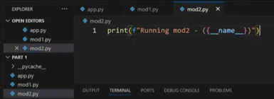
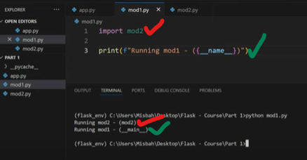

- Now, we ran mod1.py, python saw import mod2, and it executed mod2.py [print(f"Running mod2 - {(__name__)}")]. 
- So, when we run a module like here mod1; mod1's scope __name__ is called __main__. Other imported module called their __name__ is module name like here it is mod2.

=====================================================

# Example

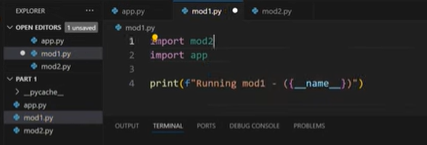
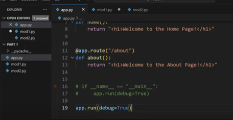

- Here we want to ipmort app. But we import app and run mod1. then app.run will execute/run the application. which we don't want to run application; just use a class inside form the app.

- For importing a module, which may the reason for running the application; which is not a good thing.

- Thus we use:

```python
if __name__ = "__main__":
  app.run(debug = True)
```

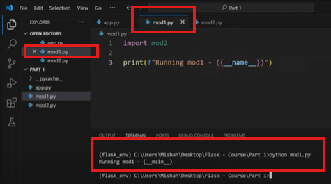
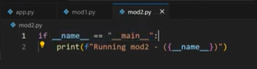

- So, for this block of code When we run mod1.py, as we import mod2, and python execute this mod2.py. But
the "if" codition is not true here. Respected of mod1 mod2's __name__ is not __main__, it's mod2.


