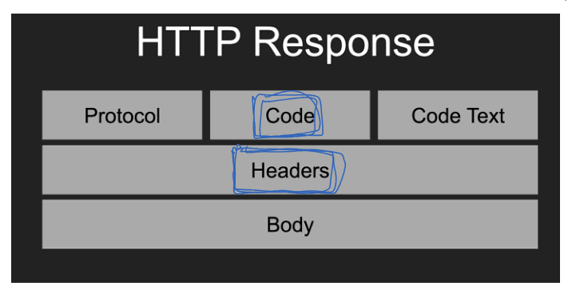
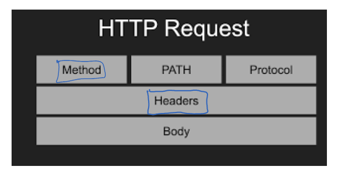
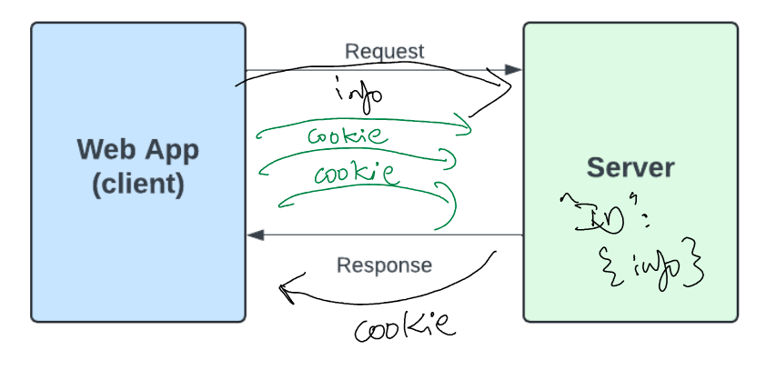

# Understanding HTTP Cookies

A **cookie**, technically known as an **HTTP cookie**, is a small piece of data stored within the browser where the end user is interacting with a web application.

## Purpose of Cookies

- The main purpose of a cookie is to **remember user preferences** across sessions.
- This helps provide users with a **personalized experience**.
- Cookies allow web applications to remember things like:
  - Login credentials (optional)
  - Shopping cart contents
  - User settings such as language, theme, or appearance
  - Analytics data, e.g., how long users stay on a site, what they interact with

## Cookie Storage

- Cookies are stored **within the browser**.
- Each browser has its own database system to store cookies:
  - **Chrome** and **Firefox** use an **SQLite** database to store cookies.
- Though cookies are simple, they use databases even at the client side to persist data.

## Cookies and Sessions

- When a user logs into an application, the browser sends a request to the server.
- The server generates a **session ID**.
- This session ID is sent back to the client and stored as a cookie in the browser.
- This allows the server to **remember the session** in subsequent requests from the same client.

## Structure and Usage

- A cookie is essentially a **data container**.
- It is **sent from the server to the client** and stored in the client's browser.
- This data is then included with each subsequent request to help the server remember user-specific information.

## Types of Information Stored

Cookies can store various types of data including:

- User preferences (like language, theme)
- Authentication data (login status, tokens)
- Shopping cart items
- Analytics tracking information

## Security Considerations

Cookies can be vulnerable to attacks such as:

- **CSRF (Cross-Site Request Forgery)**
- **XSS (Cross-Site Scripting)**

To mitigate these risks, certain **cookie attributes** should be configured properly, such as:

- `HttpOnly`: Prevents access to the cookie via JavaScript
- `Secure`: Ensures the cookie is sent only over HTTPS
- `SameSite`: Helps prevent CSRF by controlling how cookies are sent with cross-site requests

## Summary

In simple terms:

- A **cookie** is a **small piece of data** sent from the **server to the client**, stored in the browser.
- It helps in **remembering user preferences** and **providing a better user experience**.
- Cookies are stored using databases like **SQLite** in modern browsers.
- They are closely related to **sessions** and play a crucial role in maintaining session state.

## 2. Why Cookies?

Cookies help improve the overall **user browsing experience** in several ways:

- ✅ **Maintaining login status**  
  Cookies remember that a user is logged in, so they don't have to re-enter their credentials on every page.

- 🛒 **Shopping carts in online retail stores**  
  Cookies store cart items even if the user navigates away or closes the browser.

- 🎨 **Store user preferences**  
  This includes:
  - Language settings
  - Theme (light/dark mode)
  - UI appearance
  - Other custom settings

- 📈 **Save website traffic data for analytics**  
  Helps site owners understand user behavior and improve the site accordingly.

- 🔐 **Enhance security**  
  Properly configured cookies can help **reduce CSRF and XSS attacks** by using attributes like:
  - `HttpOnly`
  - `Secure`
  - `SameSite`


# Working of Cookies

1. Initial Request
When a user visits a web application and interacts with it, the browser sends an HTTP request to the server.

2. Server Response and Cookie Creation
The server processes the request, generates a response, and sends it back to the client (browser).
Along with the response, the server includes a Set-Cookie header to create a cookie and store a session ID.
Example:

``` yaml
Set-Cookie: sessionId=abc123; Expires=Wed, 21 Oct 2023 07:28:00 GMT; Secure; HttpOnly
```
---
When the server sends an HTTP response message, it follows a basic structure. Any response message will contain these blocks: protocol, status code, status text, headers, and body.

What’s important here is the **headers** section. Inside the response headers, the server will set a header called **Set-Cookie**.

The server uses the **Set-Cookie** header to create a cookie. This header contains various attributes of the cookie, such as its value, session ID, expiration time, and other settings.

This is how the server tells the client to create and store a cookie. The **Set-Cookie** header and its attributes are included in the headers section of the response message.


---

3. Attributes of a Cookie
The Set-Cookie header can contain several attributes:

- Name/Value: The actual data of the cookie.

- Expires / Max-Age: Specifies how long the cookie should persist.

- Path: Defines the scope (URL path) where the cookie is valid.

- Secure: Ensures the cookie is sent only over HTTPS.

- HttpOnly: Prevents JavaScript access to the cookie (helps prevent XSS attacks).

- SameSite: Restricts cross-site sending of cookies (helps prevent CSRF attacks).

4. Client-Side Storage
Once received, cookies are stored on the client-side.
The storage location depends on the browser and the operating system. Typically, cookies are saved in local browser-managed databases, such as SQLite.

5. Subsequent Requests
For every subsequent HTTP request, the browser automatically includes relevant cookies in the Cookie header.
Example:

``` makefile
Cookie: sessionId=abc123; userId=78910; theme=dark
```
---
But how is it sent? As it turns out, when we talk about an HTTP request message, it has a structure that includes:

- **Method**: This indicates the type of operation we want to perform, such as GET, POST, PUT, DELETE, etc.
- **Path**: The path of the URL or application.
- **Headers**: The request message also contains a headers section.

At the server side, we use the `Set-Cookie` header to set a cookie. From the client side, if we want to send a cookie back to the server, we use the `Cookie` header.

Inside the `Cookie` header, we include whatever cookie information we want to send to the server, like this:

``` makefile
Cookie: sessionId=abc123; userId=78910; theme=dark
```



> This is how cookie information is sent from the client to the server in HTTP requests.
----

6. Session Identification
The server reads the cookies from incoming requests to identify the user session.
This allows the server to retrieve stored session data and provide a personalized experience.

7. Cookie Expiration
Cookies with an Expires or Max-Age attribute are automatically removed when the time limit is reached.
Session cookies (without expiration) are deleted when the browser is closed.

> This process ensures stateful communication between the client and server in a stateless HTTP protocol environment, enabling user sessions, preferences, and security settings to persist seamlessly.

-------------


A web app acts as the client, and we also have a server. When the very first request is sent from the client to the server, a **session ID** is generated. Along with this, any information included in the request is also captured and stored on the server side.

When the server sends back a response, it includes the session ID — and optionally some of the request information — in the form of a **cookie**. This cookie is sent back to the client.

Within the application, these cookies can then be stored in the **database**. This is how the interaction between the client and server happens using cookies and session IDs.
----------
Once the cookie is retrieved at the application, every interaction we do with the application generates a new request. In each request, the cookie information is sent to the server.

After the cookie has been received, for every subsequent request, the cookie information will be shared with the server.

Based on the received cookie information, the server can identify who the user is and what their preferences are. This is why maintaining the cookie is important.
---------

## Finally

### Complete Picture of How Sessions and Cookies Work

- When a **user visits an application for the first time**, the browser sends an HTTP **request** to the server with relevant information.
- The **server** generates a **session ID** and stores the received information inside a **session store**.
- Now the **server knows** who the user is and what their information is.

### Keeping the Browser Informed

- But how will the browser know? Since **HTTP is stateless**, it doesn’t remember anything between requests.
- To solve this, the server sends the stored session information **back to the client as a cookie**.
- This is done using the **`Set-Cookie`** header, included inside the **headers section** of the **HTTP response message**.
- The **client (browser)** receives this cookie and **stores** the session data.

### Sharing Data Back to Server

- When the user interacts again (e.g., clicks or navigates), **more information is generated**.
- The client (browser) sends this updated information **back to the server** in a new **request message**.
- Inside this request’s **headers section**, the client includes a **`Cookie`** header.
- This `Cookie` header contains all session and user data gathered so far, including any additional information.

```http
Cookie: sessionId=abc123; theme=dark; language=en
```

# Purpose and Benefit
The server identifies the session ID from the request and updates the session store accordingly.

This process allows the server and browser to maintain and persist user preferences, session data, and user identity.

The main purpose of this mechanism is to:

Store information about each user interaction.

Provide a personalized and convenient browsing experience.

# Summary
Sessions and cookies work together to help both client and server remember important user data.

This enables features like staying logged in, preferred settings, and other customized experiences for the user.
