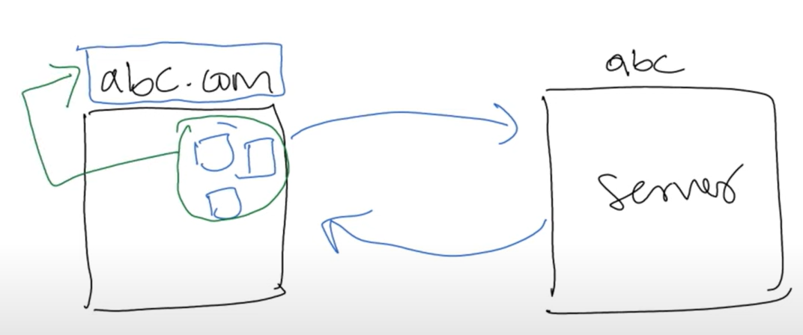

# Types of Cookies

## First-party Cookies
- These cookies are used by the same application/website that the user is currently interacting with.
- They are considered to be more secure and protected, as they can only be accessed by the website the user is currently visiting.
- **First-party cookies help with:**
  - Maintaining login status in the application
  - Keeping track of and storing user's preferences (language, theme, custom settings)
  - Tracking the duration of visits on the application
  - Providing a personalized experience

-------

# First-party Cookies – How They Work

We are users, and we are trying to access a web page:

**Website:** `abc.com`  
This is the application we are interested in and want to interact with.

Since it's a web application, it is obviously connected to a **server**.  
So, we have the **server of abc.com** that handles our interactions.

### What happens when we interact?

1. A **request** is generated from the client (user/browser).
2. The **server** processes the request and sends a **response**.
3. During this exchange, information is passed back to the **client** in the form of **cookies**.

These cookies are stored **on the client-side (browser)** and are associated with the same application (`abc.com`) that we are using.

### These are called **First-party Cookies**.

- First-party cookies are those used by the **same application** that the user is currently interacting with.
- They are stored in the browser and associated only with the domain (`abc.com`) being accessed.

### Why are First-party Cookies considered secure?

- They can **only be accessed by the application** that created them (in this case, `abc.com`).
- No other application or domain can access these cookies.

So, to summarize:

> Whenever we access an application like `abc.com`, the interaction (request-response) may result in cookies being stored on the client side.  
> Since these cookies are created and used by the **same application**, they are categorized as **First-party Cookies** and are considered **more secure**.
----

## Third-party Cookies
- These are cookies stored in the browser but created by a website other than the one the user is currently visiting.
- They are associated with greater security concerns as they expose users' browsing data to external parties (sometimes without consent).
- **These cookies are mainly used for:**
  - Tracking a user's activities across different websites to generate targeted ads
  - Analyzing website traffic and performance for analytics
  - Tailoring social media feeds by tracking user activity
  - Generating user profiles based on data collected from various websites

## What Happens When We Select 'Accept All Cookies'?
- It's equivalent to a user giving consent to store and use both first-party and third-party cookies.
- Allows third-party companies to collect browsing data and activity across multiple websites. This helps with:
  - Targeted ad generation
  - Building user profiles
- Carries a **higher risk of data leakage** if third-party companies are compromised.

